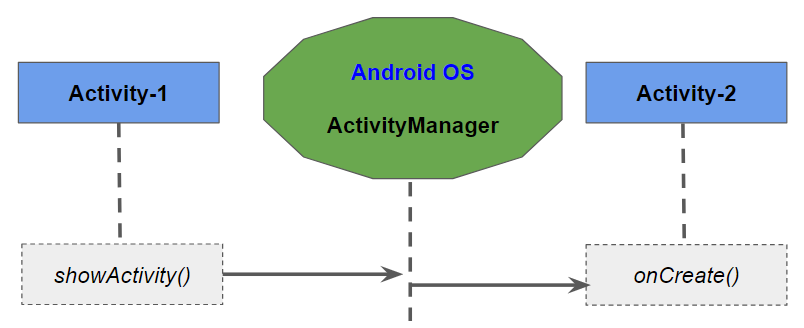

# Interaction between Two Activity

This section covers how two activities can interact with each other and how it is implemented in Android

## startActivity and Intent

An Activity **cannot** start another Activity directly. An activity needs to raise that request to the Android OS to  trigger a new Activity. **ActivityManager** of the Android OS handles these request

**startActivity** is a method in Activity where it takes a minimum argument  - **Intent**

###  Intent

An intent is an object that a component can use to communicate with the **OS**. Example of some components are **Activities, Services, Broadcast Receivers, and Content Providers**.

Intents are multipurpose communication tools, and the Intent class provides different constructors depending on what you are using the intent to do.

#### Steps

1. Activity-1 will create an Intent which contains details about the Activity-2, which it needs to start
2. Activity-1 will invoke the startActivity() method which will request the **ActivityManager** of **Android OS** to start the Activity.
3. **ActivityManager** will use the Intent to identify the requested Activity (Activity-2) to be created. It will then check the package's manifest for such an Activity. If not found it will throw an exception - ActivityNotFoundException. **This is why it is a MUST to define all activities in the manifest**.
4. **ActivityManager** then creates the Activity instance and calls in **onCreate** method.

#### Why it is Designed this way?

Why an Activity needs to depend on Android OS to create another activity instance ?  In this case we are trying to activate an instance from within the application. That is Activity-1 and Activity-2 are components within the same application. 

However there will be cases where you need to trigger an activity in another application. In such a case we will not be able to create that instance directly and need to depend on Android OS. 

So a generic design is followed in Android to communicate between components.

##### Manifest file

1. When there is a request to start an activity, the  ActivityManager will make use of the Manifest file for the presence of the Activity.

2. When user launches an application, the ActivityManager will first look at the corresponding Manifest file, identify its Launcher Activity and creates an instance of it. Activity declares this using the intent-filter tag

   > Example:
   >
   >
   >        <application
   >        ... >
   >        <activity android:name=".QuizActivity">
   >             <intent-filter>
   >                 <action android:name="android.intent.action.MAIN"/>
   >                 <category android:name="android.intent.category.LAUNCHER"/>
   >             </intent-filter>
   >         </activity>
   >     
   >         <activity android:name=".CheatActivity">
   >         </activity>
   >     </application>

3. **ActivityManager** also maintains a **back stack**.  This will be shared by **ALL** Applications. Activities for all applications share the back stack, which is one reason the **ActivityManager** is involved in starting your activities and lives with the OS and not your application. The stack represents the use of the OS and device as a whole rather than the use of a single application.

#### Explicit and Implicit Intents

When we create an intent with a Context and Class object we are creating an explicit Intent. This is to handle activities within a package / application. 

Implicit Intent will be used when an application wants to communicate with the activity of an external application. Implicit Intent will not specify a component but they will include enough information for the system to determine which of the available components is best to run for that intent

# Bundle vs Intent

**Bundle** is a placeholder to carry data. The data will be maintained within it as Key-Value pairs

An **intent** is an abstract description of an operation to be performed. It can be used with `startActivity` to launch an `Activity`, `broadcastIntent` to send it to any interested `BroadcastReceiver` components, and `startService(Intent)` or `bindService(Intent, ServiceConnection, int)` to communicate with a background `Service`. 

An Intent will contain **extras** -- which  is a **`Bundle` **of any additional information.

