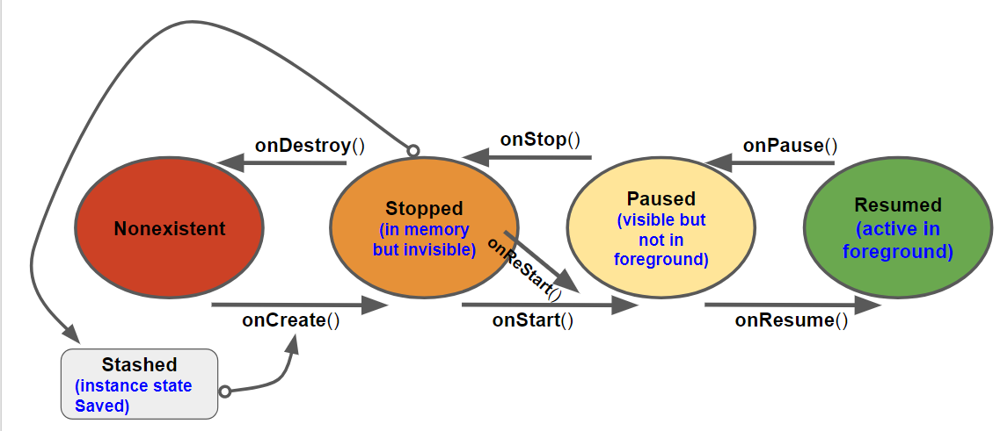

# Android Activity Lifecycle

This project is to demonstrates the following

1. Various lifecycle of the Android application. Logs will be used to demonstrate the lifecycle
2. Impact of rotation on Activity Lifecycle
3. How to save data across rotation


## Lifecycle 

There are **FOUR** states for an Android Application -

​		**Nonexistent, Stopped, Paused  and Resumed**



The activity methods that notifies this state change are 

​	**onCreate(), onDestroy(), onStart(), onStop(), onResume() and onPause()**

The resumed state represents the activity the user is currently interacting with. **Only one activity across all the apps on the device can be in the resumed state at any given time.**

Never call activity lifecycle methods explicitly. It will be triggered automatically based on lifecycle changes.


## Activity State and its Characteristics


| State       | In memory? | Visible to user? | In foreground? |
| ----------- | ---------- | ---------------- | -------------- |
| nonexistent | no         | no               | no             |
| stopped     | yes        | no               | no             |
| paused      | yes        | yes/partially*   | no             |
| resumed     | yes        | yes              | yes            |


#Logging Message

Android provide a Log class to send logs to shared system level log. The class is **android.util.Log**

There are different Log levels and for each level there is a specific method

| Log level | Method   | Used for                           |
| --------- | -------- | ---------------------------------- |
| ERROR     | Log.e(…) | errors                             |
| WARNING   | Log.w(…) | warnings                           |
| INFO      | Log.i(…) | informational messages             |
| DEBUG     | Log.d(…) | debug output (may be filtered out) |
| VERBOSE   | Log.v(…) | development only                   |

There are two flavors for each method

```
public static int d(String tag, String msg)
```

```
public static int d(String tag, String msg, Throwable excep)
```

TAG is an identifier generally used to mention the Activity name from which Log is written

## Logcat

Logcat is a log viewer included in the Android SDK tools

It also provides filters to extract logs based on Tag name

## User action vs Events

| User Actions                            | Events in Order                          |
| --------------------------------------- | ---------------------------------------- |
| Launch an Application                   | OnCreate() => onStart() => onResume()    |
| Back Button from Application            | OnPause() => OnStop() => OnDestroy()     |
| Home Button from Application            | OnPause() => OnStop()                    |
| Recent Button or long click Home Button | onStart() => onResume()    { *OnCreate() is **NOT** invoked as the **app** is already available in the background*  } |
| Rotate the Devise                       | It will **Destroy** the current app and create a **NEW** instance by DEFAULT |


# Rotation and Activity Lifecycle

When the mobile is rotated , the application in the foreground will get restarted. That is the current instance get destroyed and a new version get created. This is a problem as all the activity you did prior to rotate will get lost.

## #Device Configuration

The device configuration is a set of characteristics that describe the current state of an individual device. The characteristics that make up the configuration include **screen orientation, screen density, screen size, keyboard type, dock mode, language, and more**.

Screen density is a fixed component of the device configuration; it cannot change at runtime. On the other hand, some components, like screen orientation, can change at runtime.

###Why rotation destroys and recreates new instance for the application ?

When  we rotate the devise its **device configuration** changes.  There are resources which are better matter for each device configuration. So Android destroys the activity, looks for resources that are the best fit for the new configuration, and then rebuilds a new instance of the activity with those resources.

 

## Project Work

This section describes the features that will be tried out 

1. Create a copy of the previous project -  MultiQuestionQuiz 
2. Define Logs for each events and view in LogCat when it is triggered
3. Define a new layout for landscape
4. View the event activities when user rotates the device
5. Saving data across rotation so that the previous state is restored after rotation.

