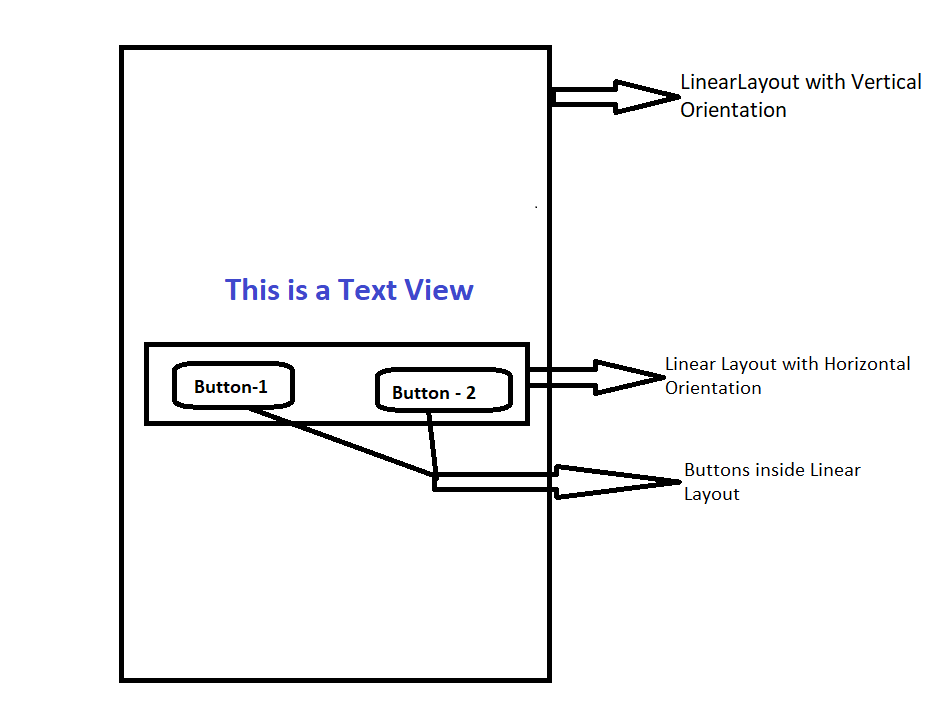

# GeoQuiz

This is my first android app project

##Objective

1. To learn how to create a simple android app (equivalent to a Hello World App)
2. Understand the basic components of an android app
3. How they interact with each other
4. How to compile and execute the App


# What I have learned?

## Activity

An Activity manages the user interaction of a screen in the mobile application. 
It manages the user interface.
To create a user interface we need to define a class which is derived (subclass-ed) from Activity.

> Example:
> > UserActivity - A class derived from Activity

## Layout

A Layout defines a set of UI objects and their position on the screen. 
It is defined in an XML format.
There will be an XML Layout file corresponding to each Activity

> Example:
> > activity_user.xml : The Layout definition for UserActivity

*The layout name reverses the order of the activity name, is all lowercase, and has underscores between words. This naming style is recommended for layouts as well as other resources that you will learn about later*

** An Activity manages what the Layout defines **

# Creating an Android Project
1. Open Android Studio
2. Select "Start a new Android studio Project"
3. Specify the Application Name, package name as Company Domain and Project Location.
4. Select the targeted devices for the App.
5. Select Empty Activity from the Activity Template List
6. Specify the Activity name (QuizActivity) and Layout name (activity_quiz.xml)

This will result in creating an Android project in Android Studio

# Define Layout

**Widgets** are building blocks to compose a UI. It consists of  **Buttons, TextView etc** using which user can interact. It also contains layouts like **RelativeLayout, LinearLayout etc** to hold other widgets. 

A Layout can hold widgets and other Layouts.

> Example: LinearLayout
> > A LinearLayout has Vertical and Horizontal orientations which can be used to align widgets vertically or horizontally

Layouts are derived from ViewGroup, which is a subclass of View.

A ViewGroup is a widget which can contain and arrange other widgets.

#View Hierarchy

Widgets exist in a hierarchy of View objects called the view hierarchy.
> Example
> > Let us consider a UI as follows
> > The UI contains a LinearLayout in Vertical orientation and in it contains [1] A Text View and [2] another LinearLayout. The inner LinearLayout which has a horizontal orientation will contain two buttons. 
> >
> > LinearLayout -1 ==> Text View & [ LinearLayout - 2  => Button1 & Button 2]





# Widget Attributes

This section covers some of the common widget attributes

## android:layout_width and android:layout_height

These attributes will be there for every widgets to define the dimension of it. Normally it take two values 

* match_parent :  View will inherit the size of the parent in which it is contained
* wrap_content : View will be based on the content it holds.

## android:padding

This is to define spacing to its content when determining the size

> Example:  `android:padding="24dp"` 

## android:orientation

This is to define how its contents will be placed. The values it can take is Vertical and Horizontal.

In a Vertical orientation, the first component will be placed top most and where as in horizontal orientation, the first component will be placed left most.

## android:text

This is to define the text to be displayed by the widget.

Normally the values of this property will be reference to **string** resources instead of hardcoding. Though direct value can be provided it is not a good practice as it is **NOT** localization friendly.

> Example:  android:text="@string/false_button

## android:id

The attribute to define the resource ID for a widget.  We use a + sign to define the resource ID. This is to indicate that we are using it only for reference and not as value.

> Example: android:id="@+id/false_button"
>
> Here + indicates we are using the value as reference and not as String.

# String Resource

A string resource is a string that lives in a separate XML file called strings file. By default strings file will be named as strings.xml.

All the strings are defined under **<resources>** tag.

Each String will be defined using a **<string>** tag.

> Example:
>
> > ```
> > <resources>
> >     <string name="app_name">GeoQuiz</string>
> >     <string name="info_text">Welcome to Android App.</string>
> >     <string name="yes_button">Yes</string>
> >     <string name="no_button">NO</string>
> > </resources>
> > ```


The strings defined in the strings.xml file can be referred in layout XML file.

>  Example: android:text="@string/yes_button"

We can give any name to the strings resource file. Also there can be more than one strings resource file.

activity XML file will show errors if any of the text reference is missing in strings file.

# Preview Activity

The Activity defined in activity XML file can be previewed in Android Studio. After resolving all the errors select the activity file and studio will display a preview of the Activity. 

This preview will not happen magically.  The underlying activity class has the code to render the view using its corresponding activity layout file.

Activity has an **onCreate()** method with in which it will invoke the corresponding layout using the function 

> ```
> setContentView(R.layout.activity_quiz);
>
> This method inflates the XML layout file and display the view.
> ```


## Resource and Resource IDs

A ** Resource** is a piece of you application that is not a code. A layout is a resource. It can also be image files, audio files , XML files etc.

Resources are maintained in **app/res** directory.  The Layout file is maintained at **res/layout** directory. The strings file are maintained at **res/values** directory. 

We should use the resource ID to access the resource in Code. 

>  Example: The ID for activity layout is R.layout.activity_quiz

The application will generate a **R.java** file based on the resources defined in the project. It will get updated as an when the resources are modified.

Even the strings has got resource ID => R.string.app_name

There is **NO** need to define resource IDs for all the widgets. It is required for only those widgets used for interaction.  The ID for a resource can be generated using the attribute - android:id 

## Getting References to Widgets

In the code we may need to get access to some widgets. It can be obtained by using **findViewById(resourceId)** method in activity

> Example:
>
> > To get access to a Button in an activity 
> >
> > Button mTrueButton  = (Button) findViewByID(R.id.true_button)


## Setting Listeners

Android applications are event driven. As in Java, we need to define listener class for the widget to respond to an event. 

> Example: To add a listener to a Button use its method => setOnClickListener()

The Listener has an **onClick()** method in the case of Buttons, which will get triggered once Button is clicked.

# Making Toast

A toast is a short message to the user but does not require any action. 

To create a Toast message use the following method

```
  public static Toast makeText(Context context, int resId, int duration)
  
  Context : Typically an activity instance
  resId: is the string resource ID corresponding to the message it needs to be displayed.
  duration : How long toast must be displayed.
```

> Example :
>
> > ```
> > Toast.makeText(QuizActivity.this,
> >                        R.string.incorrect_toast,
> >                        Toast.LENGTH_SHORT).show();
> > ```