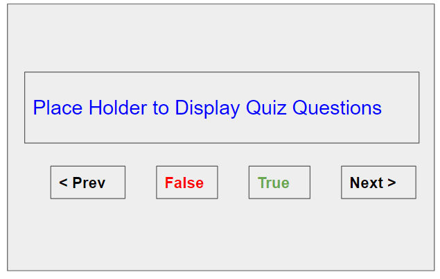
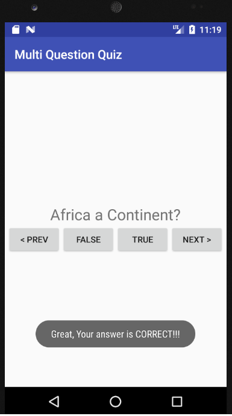

# Quiz with Multiple Questions

In this example user will be prompted with a multiple questions with True / False answer.

On selecting True / False, system will display whether the answer is Correct or False.

User can Navigate back and forth between questions. 

## Design

The application will make use of **MVC** pattern for implementing this project.

Model will be a **Question** class which will store the question key and the answer

Controller will be **QuizActivity** class which will hold a set of questions and will interact with the View. The main activities will be to supply Questions, check whether answer is correct and manage navigation between questions.

View will be the Layout defined in **activity_quiz.xml** 

All the Questions will be localized in strings.xml file and Question class holds only reference to it.

##Use Cases

1. User will be displayed with a Quiz question on initiating the App

2. System will display the whether the user answer is correct or wrong based on the True/False button selected by the user.

3. User can Navigate to Next and Previous Question by clicking on the Next/Previous Buttons.

   ​

## Implementation

1. Create a new Android Project - MultiQuestionQuiz

2. Create a model class - Question, which takes a Question Id and answer value as constructor argument. Also define getters for attributes.

3. Now define strings.xml to define questions and button texts

4. Define the activity_quiz.xml with Layout information.  The TextView and Buttons must have ID associated with it so that it can be accessed from Activity.

5. Define the methods in Activity to handle the following

     1.	Initialize Questions
     2.	 Define listeners for True , False , Next and Previous Buttons
     3.	In the case of True / False buttons, display a Toast message to show the correctness of selection
     4.	Change the questions based on the Next / Previous buttons

## Sample Output

   

   